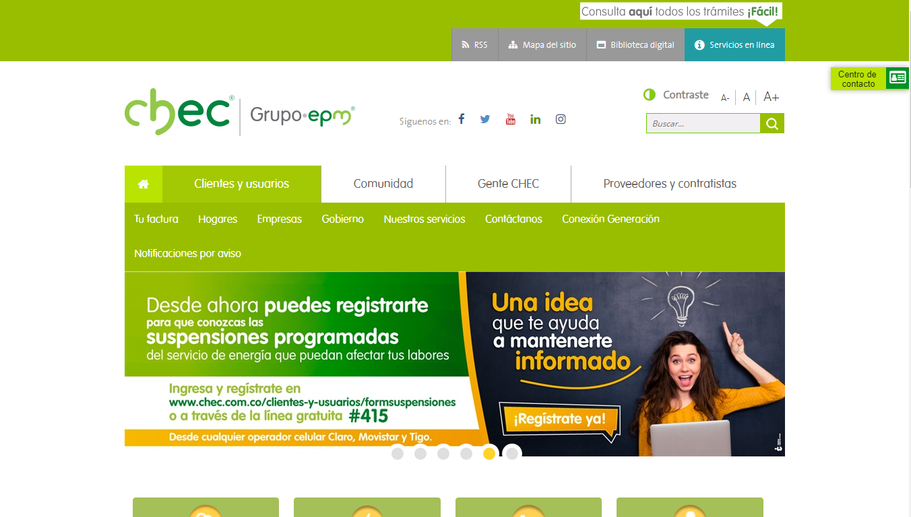

# Chatbot Lucy para Web
## Documentación

### Instalación
Para instalar el módulo, se deben añadir el directorio **src** en el directorio raiz de la página web.
Adicionalmente se deben añadir el siguiente código en la página en la que se quiere habilitar el botón del chat, por lo general index.htnl.
```
  <!--Modal-->
  <div class="modal" id="modal">
    <div class="cuerpoPortalesChec">
      
    </div>
  </div>
  <!--Modal-->

  

  <!--Chat-->
  <div class="one">

    <div id="cabecera">
      <i class="fa fa-minus" aria-hidden="true" id="botonMin"></i>
    </div>

    <iframe id="ifr1" src='URL del iframe' frameborder="0"></iframe>
  </div>
  
  <!--Chat-->

  <!-- Dependencies import -->
  <script src='https://cdnjs.cloudflare.com/ajax/libs/jquery/3.2.1/jquery.min.js'> </script>
  <script src="./src/js/script.js" type="module"></script>
  <link href="https://stackpath.bootstrapcdn.com/font-awesome/4.7.0/css/font-awesome.min.css" rel="stylesheet"
    integrity="sha384-wvfXpqpZZVQGK6TAh5PVlGOfQNHSoD2xbE+QkPxCAFlNEevoEH3Sl0sibVcOQVnN" crossorigin="anonymous">
  <!-- Dependencies import -->
```
Para mejorar el rendimiento se recomienda que el fragmento de código `Dependencies import` se ubique al final de la etiqueta `<body>`

### Configuración 
Para configurar el módulo se debe acceder al directorio *src/js/config.js*.

#### Opens Chat
La variable `opens_chat` agrupa todos los posibles elementos de la página que harán que el modal del chat se despliegue. Para añadir o modificar los elementos que abren el modal del chat, se debe editar el selector `jQuery` que inicializa la variable indicada anteriormente.
_El formato de selección es de tipo Selector jQuery_
**NO ELIMINAR EL SELECTOR .share**
**Ejemplo:**
```
export var opens_chat =   $('.share, .cuerpoPortalesChec, #boton1, .clase_boton2')
```

#### Modal
La variable `dialog_id` comprende el selector del modal inicial que debe cerrarse para abrir el diálogo del chat. Modificarlo por el selector adecuado que apunte al modal inicial de la página.
_El formato de selección es de tipo Selector jQuery_
```
export var dialog_id = $("#modal")
```
